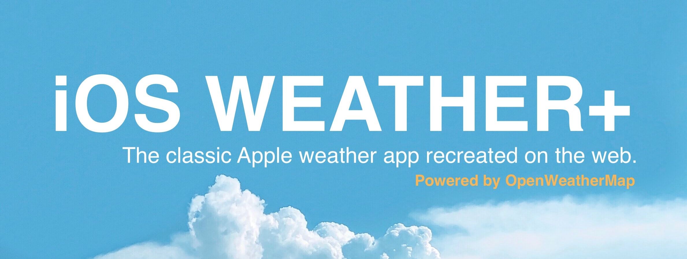
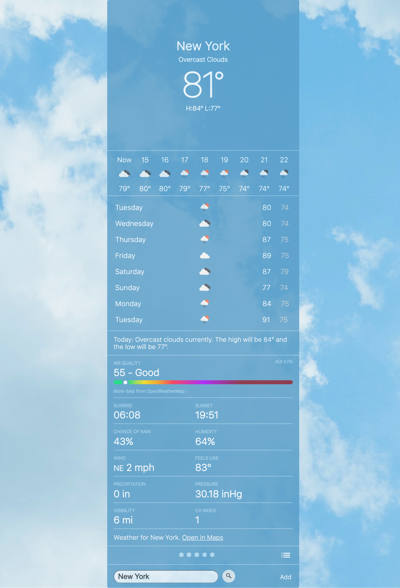

# iOS Weather+

Utilizing OpenWeatherMap's:
- [Current Weather Data API](https://openweathermap.org/current)
- [One Call API](https://openweathermap.org/api/one-call-api)
- [Air Pollution API](https://openweathermap.org/api/air-pollution)

## Screenshots

## How to Use
- Clone repository
- Edit script.js to include your OpenWeatherMap API Key
- Open index.html in web browser
- Search for location by city name

## Notes
With OpenWeatherMap's free subscription API, there is not enough pollution data to accurately calculate the AQI on a 0-500 scale like Apple's BreezoMeter.

## Features In-Development
- Drop down hamburger menu for adding locations
- Saving locations
- Alternative search terms (ex: listing by zip code, state, etc.)